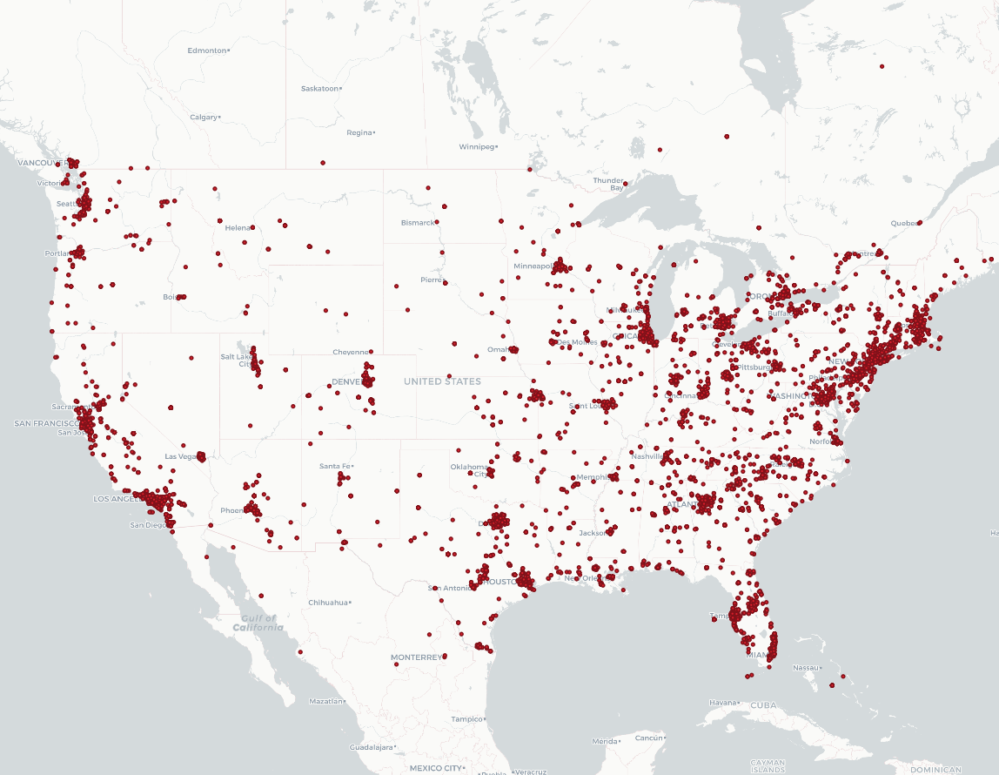

# geotweets

I chose to make a comparison of tweets in the United States from two different time periods. The first time period was from around 10:00pm to 10:30pm and the seconds time period was from about 10:00am to 10:30am. The reason that I chose to do this is because I wanted to analyze the difference in behavior across the coasts of the United States at different times. I am from Florida and a lot of my family and friends live there. I have notices that its hard to keep in touch with them sometimes because of the time change. 10:00pm PST is 1:00am EST where most people are probably going to bed. I expected there to be less activity on the east coast at that time compared to the second time period that I chose. Below are maps of the data that I collected from the tweets.

**Here is the first map**

**Here is the second map**

As you can see in these maps, there is a significant increase in tweets from the east coast in the second time period where there are probably more people awake. 1:00pm is around the time that a lot of people will take lunch breaks and have some time to go on their phones and maybe tweet. I can use this information to try and schedule better times to talk with family and friends that live on the east coast.
One of the interesting things that I noticed is that the west coast seems to be about the same in both time periods. These are times that Work well for me and I typically have free time around these times so it makes sense. That works out even better for me being able to talk to family and friend around these times.
This all represents the geo-spatial pattern of internet use based on time zone. As you can see there are different times across the country where people use Twitter more. This is probably also representative of the rest of the internet. This type of information is particularly useful for countries that span a large amount of longitudinal lines, such as the US, since that country will most likely span multiple time zones.

**Here is the first word-art**

**Here is the second word-art**

Both of these word arts seem to be pretty similar. I chose to leave in tweets that were not in english because I wanted to make sure to include people that did not primarily speak english and were still tweeting from the United States. The first few most popular words seem to be in spanish and Portuguese. I think that it is interesting how most people don't think about how there are many different languages that are spoken in the US besides english. I only speak spanish and english and I hope to be able to learn more in the future to be able to communicate with a wider variety of people. Overall though, the time periods do not seem to have changed the content of the tweets very much, only the quantity of tweets.
